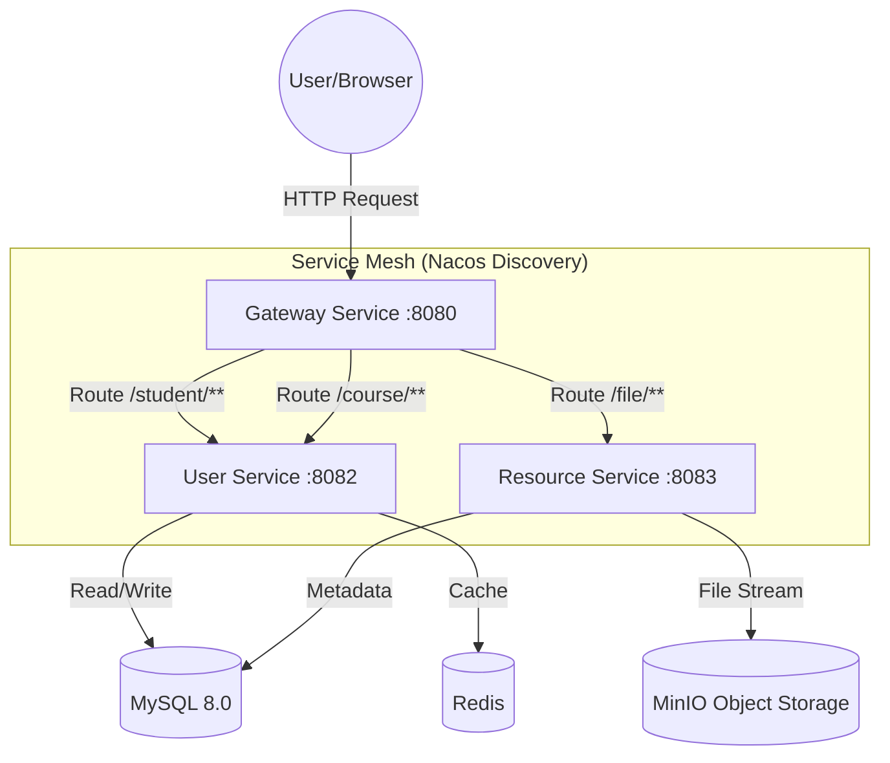

# 📼 Retro-SIMS | 微服务学生信息管理系统

<div align="center">


<p>🎹 <b>当微服务架构遇上原子朋克 (Atom Punk) —— 一次复古未来主义的全栈实践</b> 🎹</p>

[ 📺 功能演示 ](https://github.com/your-repo/demo-video) | [ 🐞 提交 Bug ](https://github.com/your-repo/issues)

</div>

---

## 📖 项目简介 (Introduction)

**Retro-SIMS** 是一个基于 **Spring Cloud Alibaba (Nacos) + Redis + MinIO + Vue3** 构建的现代化微服务教务管理系统。

本项目不仅仅是一个 CRUD 演示，它致力于探索**硬核后端治理**与**极致前端视觉**的融合，致敬 80-90 年代的科技幻想：

*   **🌌 沉浸式复古体验**：
    *   **The Portal (登录)**：复刻 **Motorola Fix Beeper** 寻呼机形态，悬浮于 3D 霓虹网格赛博空间。
    *   **The Main Console (主控)**：采用 **Cassette Futurism (磁带未来主义)** 风格，重构为 CRT 数据视窗与物理按键交互，拒绝千篇一律的 Admin 模板。
*   **⛓️ 全栈微服务架构**：标准的 **Gateway 网关 + 业务微服务 + 资源微服务** 拆分，集成 Nacos 注册中心与配置中心。
*   **💿 课程资源中心**：集成 **MinIO** 对象存储，支持课程课件的上传、下载、删除及**多条件模糊搜索**。
*   **🔌 强数据关联**：实现了学生-班级、课程-教师的完整外键逻辑与级联查询。

---

## 🏗️ 系统架构 (Architecture)

### 1. 数据流向图


### 2. 目录结构
```text
sims-project-root
├── gateway (8080)           # [网关层] 统一入口、跨域配置、路由转发
├── User_service (8082)      # [业务层] 核心业务逻辑 (Student/Class/Course/Teacher)
├── Resource_service (8083)  # [资源层] 文件服务，对接 MinIO SDK
├── common                   # [公共模块] 统一结果封装 (Result)、全局异常处理
└── UI (前端)                 # [展示层] Vue3 + Vite + Element Plus (深度定制 CSS)
```

### 3. 技术栈清单 (Tech Stack)

| 分类 | 技术组件 | 说明 |
| :--- | :--- | :--- |
| **后端核心** | Java 17, Spring Boot 2.7.18 | 基础框架 |
| **微服务** | Spring Cloud Alibaba 2021.0.5 | Nacos (注册/配置), Spring Cloud Gateway |
| **ORM** | Spring Data JPA | 持久层框架，Hibernate 实现 |
| **数据库** | MySQL 8.0, Redis | 关系型数据与缓存 |
| **对象存储** | **MinIO** | 私有化对象存储，替代本地文件系统 |
| **前端框架** | Vue 3 (Composition API) | 渐进式 JavaScript 框架 |
| **UI 组件** | Element Plus | 基础组件库 (经过大量 CSS 魔改) |
| **构建/工具** | Maven, Vite, Lombok | 项目构建与简化开发 |

---
## ⚡ 快速启动 (Boot Sequence)

### 1. 环境准备 (Prerequisites)
*   **JDK 17** (推荐) 或 1.8
*   **MySQL 8.0+**
*   **Redis** (默认端口 6379)
*   **Nacos Server 2.x** (单机模式)
*   **MinIO Server**
*   **Node.js 16+** & npm

### 2. 初始化数据库 (Data Injection)
在 MySQL 中创建数据库 `sims_cloud`，并执行以下 SQL：

```sql
CREATE DATABASE IF NOT EXISTS `sims_cloud` DEFAULT CHARACTER SET utf8mb4;
USE `sims_cloud`;

-- 1. 基础表结构 (Class, Student, Teacher, Course, SysUser)
-- (此处省略，保持你原有的 SQL 脚本即可，为了篇幅不再重复)
-- ...

-- 2. 资源表 (Course Resource - New Feature)
CREATE TABLE `course_resource` (
  `id` bigint NOT NULL AUTO_INCREMENT,
  `file_name` varchar(255) NOT NULL COMMENT '文件名',
  `file_type` varchar(20) DEFAULT NULL COMMENT '文件类型',
  `file_url` varchar(500) NOT NULL COMMENT 'MinIO下载地址',
  `course_name` varchar(100) DEFAULT NULL COMMENT '所属课程',
  `file_size` bigint DEFAULT NULL COMMENT '文件大小',
  `upload_time` datetime DEFAULT CURRENT_TIMESTAMP,
  PRIMARY KEY (`id`)
) ENGINE=InnoDB DEFAULT CHARSET=utf8mb4;
```

### 3. 中间件启动 (Middleware)

#### 🟢 步骤 A: 启动 Nacos
```bash
# Windows
startup.cmd -m standalone
```
> 访问: `http://localhost:8848/nacos` (默认账号/密码: nacos/nacos)

#### 🔵 步骤 B: 启动 MinIO
你需要启动 MinIO 服务端并配置一个公开的 Bucket。

1.  **启动服务**:
    ```cmd
    minio.exe server D:\minio_data --console-address ":9090" --address ":9000"
    ```
    *   API 端口: `9000` (后端连接用)
    *   控制台端口: `9090` (浏览器访问用)

2.  **配置 Bucket (使用 `mc` 客户端)**:
    ```cmd
    mc alias set local http://localhost:9000 minioadmin minioadmin
    mc mb local/studentmanagement
    mc anonymous set download local/studentmanagement
    ```

### 4. 服务配置 (Nacos Config)
在 Nacos 控制台新建以下配置文件 (Group: `DEFAULT_GROUP`)：

**`user-service.yaml`**:
```yaml
spring:
  datasource:
    url: jdbc:mysql://localhost:3306/sims_cloud?serverTimezone=Asia/Shanghai&useUnicode=true&characterEncoding=utf-8&useSSL=false&allowPublicKeyRetrieval=true
    username: root
    password: YOUR_PASSWORD # ⚠️ 修改密码
  redis:
    host: localhost
```

**`resource-service.yaml`**:
```yaml
spring:
  datasource:
    # 同上数据库配置...
minio:
  endpoint: http://localhost:9000
  accessKey: minioadmin
  secretKey: minioadmin
  bucketName: studentmanagement
```

### 5. 编译与运行 (Run)

**后端**:
```bash
# 在项目根目录执行 Maven 构建
mvn clean install

# 依次启动
java -jar gateway/target/gateway.jar
java -jar User_service/target/user-service.jar
java -jar Resource_service/target/resource-service.jar
```
*(或者直接在 IDEA 中运行各个 Application 类)*

**前端**:
```bash
cd UI
npm install
npm run dev
```

---

## 🛠️ 故障排查 (Troubleshooting)

| 异常现象 | 可能原因 | 解决方案 |
| :--- | :--- | :--- |
| **MinIO Upload Error** | API 端口配置错误 | 确保后端配置的是 `9000` 端口，而不是控制台的 `9090`。 |
| **Download Access Denied** | Bucket 权限未公开 | 执行 `mc anonymous set download` 命令设置桶策略为 public。 |
| **Gateway 404** | 路由覆盖 | 检查 `gateway.yaml`，确保具体的 `/file/**` 路由在通用的路由之前。 |
| **Public Key Retrieval** | MySQL 驱动安全性 | JDBC URL 必须包含 `allowPublicKeyRetrieval=true`。 |
| **Search No Data** | 前后端字段不匹配 | 检查前端接收的 JSON 字段是否为 `data` 或 `list`，确保与后端 `Result` 封装一致。 |

---

## 📄 许可证 (License)

本项目遵循 [MIT License](LICENSE) 开源协议。

---
<div align="center">
  <p>Created with ☕ and 🎹 by <b>AndyXuPrime</b></p>
</div>