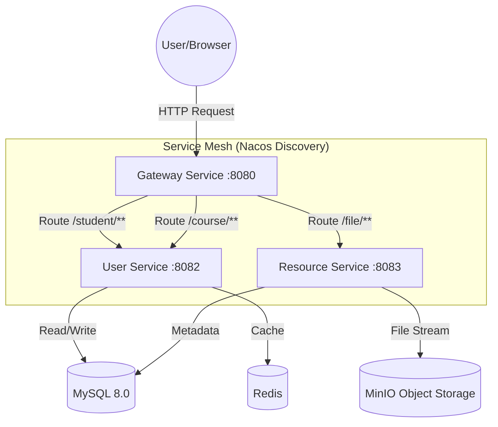

# 📼 Retro-SIMS | 微服务学生信息管理系统

<div align="center">  

  
  
  
  
  


**当微服务架构遇上原子朋克 (Atom Punk) —— 一次复古未来主义的全栈实践**

[快速开始](#-快速开始) • [功能特性](#-功能特性) • [技术栈](#️-技术栈) • [系统架构](#-系统架构)

</div>  

> 说明：以下内容以当前代码为准。更细的本地运行与接口说明见 [docs/项目运行说明.md](docs/项目运行说明.md)。
  
---  

## ✨ 最新更新 (v2025.1.0)

### 🎉 重大功能升级

1.  **💾 课程资源中心 (MinIO集成)**
    *   **对象存储**: 集成 MinIO 实现海量非结构化数据存储。
    *   **文件管理**: 支持课程课件的拖拽上传、在线下载与物理删除。
    *   **智能关联**: 文件与课程自动绑定，实现数据联动。

2.  **🔍 全局搜索增强**
    *   **多维检索**: 支持按课程名、课号、教师姓名进行模糊搜索。
    *   **资源定位**: 新增基于文件名的资源搜索功能。

3.  **🎨 视觉交互重构**
    *   **寻呼机登录 (The Portal)**: 复刻 Motorola Fix Beeper 交互体验。
    *   **CRT主控台**: 优化数据表格的扫描线特效与荧光显示效果。
    *   **验证码**: 新增 Canvas 绘制的动态干扰线复古验证码。

---  

## 📸 界面预览

### 📟 登录终端 - The Portal
- 🎨 **视觉风格**: 致敬 90 年代寻呼机，悬浮于 3D 霓虹网格之上。
- 🔐 **安全交互**: 模拟物理按键反馈，集成动态 Canvas 验证码。

### 📼 主控台 - Main Console
- 📊 **布局**: 左右分栏式 CRT 数据视窗。
- 💿 **资源管理**: 嵌入式文件管理器，支持 "INSERT DISK" 风格上传交互。
- 🕹️ **操作反馈**: 全局原子朋克音效与视觉微交互。

---  

## 🚀 快速开始

### 环境要求

- ✅ JDK 17
- ✅ MySQL 8.0+
- ✅ Redis (默认端口 6379)
- ✅ Nacos Server 2.x
- ✅ MinIO Server
- ✅ Node.js 16+

### 一键启动 (Windows)

```bash  
# 1. 启动基础设施 (Nacos & Redis 需提前运行)  
# 启动 MinIO (注意端口配置)  
minio.exe server D:\minio_data --console-address ":9090" --address ":9000"  
  
# 2. 初始化 MinIO 桶权限  
mc alias set local http://localhost:9000 minioadmin minioadmin  
mc mb local/studentmanagement  
mc anonymous set download local/studentmanagement  
  
# 3. 启动后端微服务 (按顺序)  
java -jar gateway/target/gateway-0.0.1-SNAPSHOT.jar  
java -jar User_service/target/Students_manageSys-0.0.1-SNAPSHOT.jar  
java -jar Resource_service/target/Resource_service-0.0.1-SNAPSHOT.jar  
  
# 4. 启动前端 UIcd UI  
npm install  
npm run dev  
```  

### 登录测试

当前登录接口只校验验证码，`username/password` 由前端提交但后端暂未参与鉴权。

更多详情: [故障排查指南](#-故障排查)
  
---  

## 🎯 功能特性

### 👨‍💻 系统管理
- ✅ **微服务治理**: 基于 Nacos 的服务注册与配置中心。
- ✅ **网关路由**: Gateway 统一入口与跨域处理。
- ✅ **资源隔离**: 独立的资源服务处理文件 I/O。

### 🏫 教务管理
- ✅ **学生档案**: 学号主键管理，支持班级联动查询。
- ✅ **课程中心**: 课程开设、学分设置、教师分配。
- ✅ **资源挂载**: **(New)** 课程附件上传、下载、搜索。
- ✅ **教师名录**: 教师职称与基本信息管理。
- ✅ **班级编制**: 专业与班级代码维护。

---  

## 🛠️ 技术栈

### 后端 (Backend)
- **核心框架**: Spring Boot 2.7.18
- **微服务**: Spring Cloud Alibaba 2021.0.5 (Nacos, Gateway)
- **ORM**: Spring Data JPA
- **数据库**: MySQL 8.0
- **缓存**: Redis
- **对象存储**: MinIO SDK
- **工具库**: Lombok, FastJson

### 前端 (Frontend)
- **框架**: Vue 3 (Composition API)
- **构建工具**: Vite
- **UI库**: Element Plus (深度定制 CSS)
- **HTTP**: Axios (封装拦截器)
- **视觉特效**: CSS3 Animations, Canvas API

---  

## 📂 项目结构
### 1. 数据流向图


```mermaid  
graph TD
    User((User/Browser)) -->|HTTP Request| Gateway[Gateway Service :8080]

    subgraph "Service Mesh (Nacos Discovery)"
        Gateway -->|Route /student/**| UserService[User Service :8082]
        Gateway -->|Route /course/**| UserService
        Gateway -->|Route /file/**| ResourceService[Resource Service :8083]
    end

    UserService -->|Read/Write| MySQL[(MySQL 8.0)]
    UserService -->|Cache| Redis[(Redis)]

    ResourceService -->|Metadata| MySQL
    ResourceService -->|File Stream| MinIO[(MinIO Object Storage)]
```

### 2. 目录结构
```  
Retro-SIMS/  
├── gateway (8080)             # [网关] 统一入口、路由转发  
├── User_service (8082)        # [业务] 核心 CRUD (Student/Class/Course)│   ├── src/main/java/.../controller  # REST API  
│   └── src/main/java/.../repository  # JPA DAO  
├── Resource_service (8083)    # [资源] 文件服务  
│   ├── src/main/java/.../utils       # MinIO 工具类  
│   └── src/main/java/.../service     # 文件上传/搜索逻辑  
└── UI                         # [前端] Vue3 项目  
    ├── src/views/             # 页面组件 (MinConsole.vue)    ├── src/api/               # 接口封装  
    └── src/assets/            # 字体与纹理素材  
```  
  
---  

## 🗄️ 数据库设计

| 表名 | 说明 | 主键 | 备注 |  
|------|------|------|------|  
| `student` | 学生表 | `Sno` | 外键关联 `class_info` |  
| `course` | 课程表 | `cno` | 外键关联 `teacher` |  
| `teacher` | 教师表 | `tno` | - |  
| `class_info` | 班级表 | `Classno` | - |  
| `course_resource` | 资源表 | `id` | **新增**，存储 MinIO URL |  
| `sys_user` | 管理员表 | `id` | - |  
  
---  

## 🔌 核心 API 示例

### 资源服务 (Resource Service)
```bash  
POST   /api/file/upload?courseName={name}   # 上传文件 (Multipart)
GET    /api/file/search?keyword={kw}        # 搜索文件  
DELETE /api/file/delete/{id}                # 删除文件  
```  

### 业务服务 (User Service)
```bash  
GET    /student/page?current=1&size=10  # 分页查询学生  
GET    /course/list                     # 获取课程列表  
POST   /course/add                      # 新增课程  
```  
  
---  

## ⚙️ 关键配置

### Nacos 配置 (`resource-service.yaml`)

```yaml  
server:
  port: 8083
spring:
  datasource:
    url: jdbc:mysql://localhost:3306/sims_cloud?allowPublicKeyRetrieval=true&useSSL=false
minio:
  endpoint: http://localhost:9000  # 注意是 API 端口
  accessKey: minioadmin
  secretKey: minioadmin
  bucketName: studentmanagement
```  
  
---  

## 🐛 故障排查

### 常见问题

1.  **MinIO 下载报 403 Forbidden**
    *   **原因**: Bucket 权限未公开。
    *   **解决**: 运行 `mc anonymous set download local/studentmanagement`。

2.  **前端搜索无反应**
    *   **原因**: 课程名参数未传递。
    *   **解决**: 检查 `MinConsole.vue` 中 `loadCourseFiles` 方法，确保 `form.value.cname` 不为空。

3.  **Gateway 404**
    *   **原因**: 路由匹配顺序错误。
    *   **解决**: 确保 `/file/**` 的路由配置在通用路由之前。

---  

## 🤝 贡献

欢迎提交 Pull Request 或 Issue！

1. Fork 本仓库
2. 创建特性分支 (`git checkout -b feature/NewRetroStyle`)
3. 提交更改
4. 推送到分支
5. 开启 Pull Request

---  

## 📄 许可证

MIT License
  
---  

<div align="center">  

**Keep it Retro, Keep it Cloud.**

**⭐ 如果这个项目对你有帮助，请给个Star! ⭐**

Made with ❤️ by AndyXuPrime

</div>
